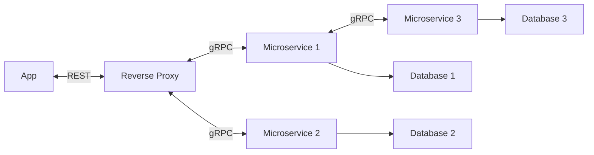

# POC - MicroService communication using gRPC

## Introduction
In gRPC, the client application can directly call the methods on a server application on a different machine as if it was a local object, making it easier to create distributed applications and services.
In essence a gRPC server would define a service, by specifying the methods that can be called remotely with their parameters and return types (proto file). The client would then use a stub to call the remote methods as if they were local methods.

## Project Structure
```
.
├── ProtoGrpc				# MicroService Project
	├── Api					# Contains Apis
		├── Admin.API				# Frontend for backend - Web Api, with gRPC stub (client)
	├── Services				# Contains Services
		├── Service1				# Our MicroService
			├── Obj					# Generated server code is saved here (regenerated on build)
			├── Protos				# Contains the proto files
				├── ProductOffer.proto			# Contains the proto files

├── Protos				# Class library containing generated code.
	├── Service1				# Generated client and server code for service1.
		├── ProductOffer.cs			# Generated Server code for ProductOffer.proto.
		├── ProductOfferGrpc.cs			# Generated Client code for ProductOffer.proto.
└── README.md
```

## Resources
- [gRPC vs. REST: How Does gRPC Compare with Traditional REST APIs?](https://blog.dreamfactory.com/grpc-vs-rest-how-does-grpc-compare-with-traditional-rest-apis/)
- [CRUD Operation And Microservice Communication Using gRPC In .NET Core 6 Web API](https://www.c-sharpcorner.com/article/crud-operation-and-microservice-communication-using-grpc-in-net-core-6-web-api/)

## Advantages / Disadvantages
- **Advantages**:
	- **Performance** - gRPC is a binary protocol, which is more efficient than JSON or XML
	- **Simplicity** - gRPC is a simpler protocol than REST
	- **Code generation** - gRPC can generate client and server code from a service definition, making development easier
	- **Streaming** - gRPC supports streaming of both requests and responses
	- **Language agnostic** - gRPC can be used with any language
	- **A lot of automation** - gRPC has alot of automation, with tools such as Postman, Swagger, etc.
- **Disadvantages**:
	- **Not as popular** - gRPC is not as popular as REST, which means that there is less documentation and less support
	- **Not as mature** - gRPC is not as mature as REST, which means that there are less tools
	- **Not as flexible** - gRPC is not as flexible as REST, which means that it is harder to implement custom logic


## Architecture
The app will go through a reverse proxy / frontend for backend application, which again routes the request to the correct microservice using gRPC.
The microservices will then respond trough gRPC to the reverse proxy, which will then forward the response to the app as a normal HTTP response of the original REST request.



## Setup
To get a gRPC microservice up and running, you need to do the following steps:
1. **Create** a new grpc service project using visual studio - **ASP.NET Core gRPC Service**
2. **Add** the following NuGet packages to the project:
	- **Grpc.AspNetCore** - ASP.NET Core gRPC framework
	- **Grpc.Tools** - gRPC tools for .NET Core
	- **Google.Protobuf** - Protocol Buffers - Google's data interchange format
3. **Create** a new proto file in the protos folder
	- Define the service and the methods

	```proto
		service dummyService {
			rpc dummyMethod (dummyRequest) returns (dummyResponse) {}
		}

		message dummyRequest {
			string dummyString = 1;
		}

		message dummyResponse {
			string dummyString = 1;
		}
	``` 
4. Generate the C# code from the proto file **(build the project)**
5. **Implement** the service
	- Implement **(override)** the service methods

	```csharp
		public class DummyService : dummyService.dummyServiceBase
		{
			public override Task<dummyResponse> dummyMethod(dummyRequest request, ServerCallContext context)
			{
				return Task.FromResult(new dummyResponse
				{
					dummyString = "Hello " + request.dummyString
				});
			}
		}
	```
	- Add the service to the DI container
	```csharp
		var builder = WebApplication.CreateBuilder(args);

		builder.Services.AddGrpc(); // add gRPC
		builder.Services.AddGrpcReflection(); // add gRPC reflection, to be able to use the gRPC reflection service
		builder.Services.AddScoped<IDummyRepository, DummyRepository>();
		builder.Services.AddDbContext<DbContextClass>();

		builder.Services.AddAutoMapper(typeof(Program).Assembly);

		var app = builder.Build();

		// Configure the HTTP request pipeline.
		app.MapGrpcService<DummyService>(); // add the service to the DI container
		app.MapGrpcReflectionService(); // add the gRPC reflection service to the DI container
	```
6. **Create** a second service / web api project and **connect** to proto file
	- Create a new project
	- Right click on the project and select **Add** -> **Connected Service**
		- Follow the instructions and select the file path to the proto file
7. **Create** class for communicating with the service
```csharp
	public class DummyClient
	{
		private readonly Channel _channel;
		private readonly dummyService.dummyServiceClient _client;
		private readonly IConfiguration _configuration;

		public DummyClient(configuration)
		{
			_configuration = configuration;
			_channel = GrpcChannel.ForAddress(_configuration.GetValue<string>("GrpcSettings:dummyService")); // check launchSettings.json for the correct address
			_client = new dummyService.dummyServiceClient(_channel); // client code generated by the proto file we connected to
		}

		public async Task<dummyResponse> dummyMethod(dummyRequest request)
		{
			return await _client.dummyMethodAsync(request); // use remote method call as if it was a local method
		}
	}
```
8. F5 :)
